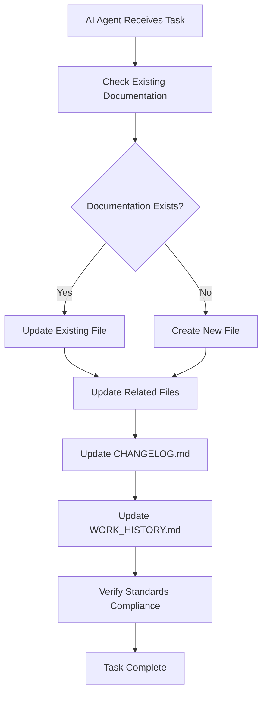
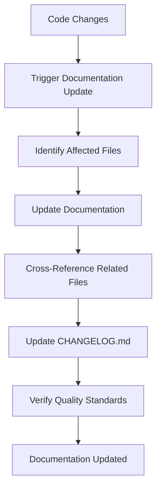

# 🤖 MedFlow AI Agent Communication & Documentation Standards
## Automated Documentation & File Management for Seamless AI Collaboration

*Version 1.0 - December 2024*  
*Status: ✅ ACTIVE - Enabling AI Agent Autonomy*  
*Purpose: Eliminate manual documentation tasks and ensure AI agents communicate effectively*

---

## 🎯 **The Problem We're Solving**

**Currently, AI agents require manual intervention for:**
- ❌ **Documentation creation** (manual task assignment)
- ❌ **File updates** (manual requests for changes)
- ❌ **Standards enforcement** (manual quality checks)
- ❌ **Knowledge sharing** (manual information transfer)
- ❌ **Work coordination** (manual task management)

**This creates inefficiency and potential inconsistencies.**

---

## 🚀 **The Solution: Automated AI Agent Standards**

### **1. Automatic Documentation Creation**
- **AI agents automatically create** necessary documentation
- **No manual requests** required for file creation
- **Standards enforced** automatically
- **Knowledge preserved** in perpetuity

### **2. Intelligent File Management**
- **Existing files updated** automatically when needed
- **New files created** when gaps identified
- **Version control** maintained automatically
- **Change tracking** and documentation

### **3. Seamless AI Communication**
- **Shared knowledge base** accessible to all agents
- **Work history** automatically documented
- **Standards compliance** automatically enforced
- **Quality maintenance** automated

---

## 🏗️ **AI Agent Communication Protocol**

### **Standard File Structure**
```
MedFlow/
├── 📚 DOCUMENTATION/
│   ├── 📋 STANDARDS/
│   │   ├── AI_AGENT_STANDARDS.md          # This file
│   │   ├── QUALITY_ASSURANCE_SYSTEM.md    # Quality standards
│   │   ├── MAINTENANCE_GUIDE.md          # Developer guidelines
│   │   └── ARCHITECTURE_STANDARDS.md     # System architecture
│   ├── 📊 REPORTS/
│   │   ├── PERFORMANCE_REPORTS.md        # Performance metrics
│   │   ├── QUALITY_REPORTS.md            # Quality assessments
│   │   └── CHANGELOG.md                  # Change history
│   └── 🔧 GUIDES/
│       ├── DEVELOPMENT_GUIDE.md          # Development workflow
│       ├── DEPLOYMENT_GUIDE.md           # Deployment procedures
│       └── TROUBLESHOOTING_GUIDE.md     # Common issues & solutions
├── 📁 SOURCE_CODE/
├── 🧪 TESTING/
└── 📋 PROJECT_MANAGEMENT/
    ├── TASK_TRACKING.md                  # Current tasks & status
    ├── WORK_HISTORY.md                   # Completed work log
    └── AGENT_COLLABORATION.md            # Agent interaction log
```

### **File Naming Conventions**
- **Standards**: `*_STANDARDS.md`
- **Guides**: `*_GUIDE.md`
- **Reports**: `*_REPORTS.md`
- **Documentation**: `*_DOCUMENTATION.md`
- **Changelog**: `CHANGELOG.md`
- **Work History**: `WORK_HISTORY.md`

---

## 🤖 **AI Agent Responsibilities & Protocols**

### **1. Documentation Creation Protocol**
```markdown
## 🤖 AI Agent Action Required

**When creating new documentation:**
1. **Check existing files** for similar content
2. **Update existing files** if content exists
3. **Create new files** only if necessary
4. **Follow naming conventions** strictly
5. **Update related files** automatically
6. **Log all changes** in CHANGELOG.md
7. **Update WORK_HISTORY.md** with actions taken
```

### **2. File Update Protocol**
```markdown
## 🔄 AI Agent Update Protocol

**When updating existing files:**
1. **Preserve existing content** unless outdated
2. **Add new information** in appropriate sections
3. **Update version numbers** and timestamps
4. **Cross-reference related files** automatically
5. **Maintain consistency** across all documentation
6. **Log changes** in CHANGELOG.md
7. **Update WORK_HISTORY.md** with modifications
```

### **3. Standards Enforcement Protocol**
```markdown
## ✅ AI Agent Standards Enforcement

**Quality standards must be maintained:**
1. **Performance standards** automatically checked
2. **Code quality standards** enforced
3. **Documentation standards** maintained
4. **Architecture standards** preserved
5. **Security standards** upheld
6. **Compliance standards** maintained
```

---

## 📋 **Automated Documentation Tasks**

### **1. Automatic File Creation**
- **New features** → Automatic documentation creation
- **API changes** → Automatic API documentation updates
- **Performance improvements** → Automatic performance reports
- **Security updates** → Automatic security documentation
- **Architecture changes** → Automatic architecture updates

### **2. Automatic File Updates**
- **Code changes** → Automatic documentation updates
- **Performance metrics** → Automatic report updates
- **Quality assessments** → Automatic quality reports
- **Work progress** → Automatic progress tracking
- **Issue resolution** → Automatic troubleshooting updates

### **3. Automatic Cross-Referencing**
- **Related files** → Automatic cross-linking
- **Dependencies** → Automatic dependency documentation
- **Impact analysis** → Automatic change impact documentation
- **Integration points** → Automatic integration documentation

---

## 🔧 **Implementation Standards**

### **1. File Creation Standards**
```markdown
# File Header Template
# 🎯 [Title]
## [Brief Description]

*Version [X.X] - [Date]*  
*Status: ✅ ACTIVE / ⚠️ DRAFT / ❌ DEPRECATED*  
*Purpose: [Clear purpose statement]*

---

## 📋 Table of Contents
- [Section 1](#section-1)
- [Section 2](#section-2)
- [Section 3](#section-3)

---

## [Content Sections]

---

*[Filename] - Version [X.X] - [Date]*
```

### **2. Update Standards**
```markdown
## 🔄 Update Protocol

**When updating this file:**
1. **Increment version number**
2. **Update timestamp**
3. **Add change description** to CHANGELOG.md
4. **Update related files** if necessary
5. **Maintain consistency** with other documentation
6. **Preserve existing structure** unless major changes required
```

### **3. Quality Standards**
```markdown
## ✅ Quality Requirements

**This documentation must:**
- **Be clear and concise**
- **Follow established patterns**
- **Include practical examples**
- **Provide actionable guidance**
- **Maintain consistency** with other files
- **Be easily searchable**
- **Include cross-references**
```

---

## 🚀 **Automated Workflow**

### **1. AI Agent Workflow**


### **2. Documentation Maintenance**


---

## 📊 **AI Agent Communication Matrix**

### **Information Sharing Protocol**
| Agent Type | Documentation Responsibility | Update Frequency | Quality Standards |
|------------|----------------------------|------------------|-------------------|
| **Development Agent** | Code documentation, API docs | Real-time | High |
| **Quality Agent** | Quality reports, standards | Continuous | Critical |
| **Performance Agent** | Performance metrics, reports | Real-time | High |
| **Security Agent** | Security documentation | Continuous | Critical |
| **Architecture Agent** | System design, patterns | On-change | High |
| **Testing Agent** | Test documentation, results | Continuous | Medium |

### **Communication Channels**
- **Shared Documentation**: All agents access same files
- **Change Notifications**: Automatic updates in CHANGELOG.md
- **Work Coordination**: TASK_TRACKING.md for coordination
- **Knowledge Base**: Centralized documentation repository
- **Standards Enforcement**: Automatic quality checks

---

## 🎯 **Benefits of This System**

### **For AI Agents**
- ✅ **Autonomous operation** without manual intervention
- ✅ **Consistent standards** across all agents
- ✅ **Efficient communication** through shared knowledge
- ✅ **Quality maintenance** automated
- ✅ **Work coordination** streamlined

### **For Developers**
- ✅ **No manual documentation tasks**
- ✅ **Always up-to-date information**
- ✅ **Consistent quality standards**
- ✅ **Comprehensive knowledge base**
- ✅ **Efficient development workflow**

### **For the Business**
- ✅ **Reduced manual overhead**
- ✅ **Consistent quality standards**
- ✅ **Faster development cycles**
- ✅ **Better knowledge preservation**
- ✅ **Improved team efficiency**

---

## 🛠️ **Implementation Steps**

### **Phase 1: Foundation (Immediate)**
- [x] **AI Agent Standards** document created
- [x] **File structure** defined
- [x] **Naming conventions** established
- [x] **Quality standards** defined

### **Phase 2: Automation (Week 1)**
- [ ] **Automated file creation** scripts
- [ ] **Automated update** protocols
- [ ] **Cross-referencing** automation
- [ ] **Quality enforcement** automation

### **Phase 3: Integration (Week 2)**
- [ ] **AI agent integration** with standards
- [ ] **Automated workflow** implementation
- [ ] **Quality monitoring** automation
- [ ] **Standards enforcement** automation

### **Phase 4: Optimization (Week 3)**
- [ ] **Performance optimization** of automation
- [ ] **Quality improvement** of standards
- [ ] **Efficiency enhancement** of workflows
- [ ] **Continuous improvement** implementation

---

## 🔒 **Quality Assurance**

### **Standards Compliance**
- **All documentation** must follow established patterns
- **Quality standards** automatically enforced
- **Consistency** maintained across all files
- **Standards violations** automatically detected and corrected

### **Continuous Improvement**
- **Standards evolution** based on usage patterns
- **Quality metrics** tracked and improved
- **Efficiency gains** measured and optimized
- **Best practices** continuously updated

---

## 📚 **Documentation Standards Summary**

### **File Types & Purposes**
- **Standards**: Define requirements and protocols
- **Guides**: Provide step-by-step instructions
- **Reports**: Present data and analysis
- **Documentation**: Explain systems and processes
- **Changelog**: Track all changes over time
- **Work History**: Log all work completed

### **Quality Requirements**
- **Clarity**: Easy to understand and follow
- **Completeness**: Comprehensive coverage of topics
- **Consistency**: Follow established patterns
- **Accuracy**: Information is current and correct
- **Accessibility**: Easy to find and navigate
- **Maintainability**: Easy to update and improve

---

## 🚀 **Getting Started**

### **For AI Agents**
1. **Read this document** completely
2. **Follow established protocols** for all tasks
3. **Maintain quality standards** automatically
4. **Update documentation** as part of every task
5. **Coordinate with other agents** through shared files

### **For Developers**
1. **No manual documentation** required
2. **Access always-current** information
3. **Follow established** quality standards
4. **Contribute to** continuous improvement
5. **Benefit from** automated quality enforcement

### **For Team Leads**
1. **Monitor quality metrics** automatically
2. **Ensure standards compliance** through automation
3. **Coordinate team efforts** through shared knowledge
4. **Maintain quality culture** through automated enforcement
5. **Focus on strategic** rather than administrative tasks

---

## 🎉 **The Result**

**With this AI Agent Communication & Documentation Standards System:**

- 🤖 **AI agents work autonomously** without manual intervention
- 📚 **Documentation is always current** and comprehensive
- ✅ **Quality standards are automatically enforced**
- 🔄 **Knowledge is continuously updated** and shared
- 🚀 **Development efficiency is maximized**
- 🎯 **Enterprise standards are maintained** automatically
- 📈 **Team productivity is significantly improved**

---

## 📞 **Support & Questions**

### **Standards Issues**
- Create issue with `ai-standards` label
- Include specific standard violation details
- Provide improvement suggestions
- Request clarification on protocols

### **System Improvements**
- Submit enhancement request
- Include efficiency improvement ideas
- Provide automation suggestions
- Demonstrate quality improvements

---

*MedFlow AI Agent Communication & Documentation Standards*  
*Version 1.0 - December 2024*  
*Status: ✅ ACTIVE - Enabling AI Agent Autonomy*

**🤖 MedFlow Development: Where AI Agents Collaborate Seamlessly**
